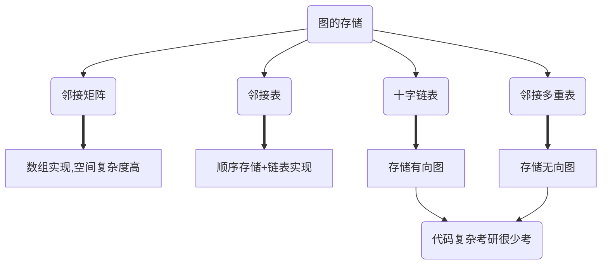

<!-- more -->

## 邻接矩阵法

``` cpp
#define VertexType int
#define MAXVertexNum 100
#define INFINITY 100//如果边的权值大于等于该值，称该边无穷长
struct MGraph
{
    VertexType Vex[MAXVertexNum];//顶点
    int Edge[MAXVertexNum][MAXVertexNum];//邻接矩阵
    int vexnum;//当期顶点树
    int arcnum;//当前边数/弧数
};

```

对于无向图来说：邻接矩阵具有对称性

无向图的第i个顶点的度：第i行或第i列的非零元素个数($E\neq0$的个数)
有向图的第i个顶点的度： 出度：第i行非零元素个数 入度：第i列的非零元素个数 度=出+入

性能分析：空间复杂度$O(n)$ 只适用于存储稠密图
对于无向图可采用对称矩阵的压缩压缩存储

> 策略：存储主对角线和下三角区，按行优先
> $a_{i, j}\rightarrow B[k]$
> $k=\frac{i(i-1)}{2}+j-1 $

一些性质：
图G的邻接矩阵为A(矩阵元素为0/1, 即不带权值)，则$A^n$中的$a^n_{i, j}$就为由$i$到$j$的长度为$n$的路径数目
$$
A^n=\left[\begin{matrix}a_{1, 1} & a_{1, 2} & \cdots \\\\
a_{2, 1} & a_{2, 2} & \cdots \\\\
\vdots & \vdots & \ddots \end{matrix}
\right]^n
$$

## 邻接表

``` cpp

#define VertexType int
#define MAXVertexNum 100

typedef struct ArcNode
{
    int adjvex; //边指向哪一个顶点(下一个) 即AdjList[adjvex]
    ArcNode *next;
    int info;//权值
}ArcList;

typedef struct VNode
{
    VertexType data;
    ArcList first;//第一条边(随便指一条)
}AdjList[MAXVertexNum];

struct ALGraph
{
    AdjList vertices;//邻接表
    int vernum;
    int arcnum;
};
```

性能分析：
对无向图：每条边有两个顶点，所以空间复杂度为$O(2|E|+|V|)$
对有向图：空间复杂度$O(|E|+|V|)$

计算度：
对无向图：遍历对应的链表
对有向图：

* 出度：遍历对应链表
* 入度：遍历除自己外所有对应链表

## 十字链表

``` cpp
typedef struct AcrossAcrNode
{
    int tailvex;//弧尾点编号
    int headvex;//弧头点编号
    int info;
    AcrossAcrNode *hlink;//弧尾相同的下一条弧
    AcrossAcrNode *tlink;//弧头相同的下一条弧
};

typedef struct AcrossVNode
{
    VertexType data;
    AcrossAcrNode *firstin;//以该节点为弧头的第一条弧
    AcrossAcrNode *firstout;//以该节点为弧尾的第一条弧
}AVList[MAXVertexNum];

struct AcrossGraph
{
    AVList vertices;//十字链表
    int vernum;
    int arcnum;
};
```


性能分析：
空间复杂度$O(\lvert E \rvert +\lvert V \rvert)$
找到入边：顺着**hlink**一直找
找到出边：顺着**tlink**一直找

## 邻接多重表


## 总结

||邻接表|邻接矩阵|十字链表|邻接多重表 |
|---|---|---|---|---|
|空间复杂度|无向图$O(2\lvert E \rvert + \lvert V\rvert )$ 有向图$O(\lvert E \rvert +\lvert V \rvert )$|$O(\lvert  V^2\rvert)$|$O(\lvert E \rvert +\lvert V \rvert )$||
|适合于|储存稀疏图|储存稠密图|有向图|无向图|
|表示方式|不唯一|唯一|不唯一|不唯一|
|计算度|计算有向图的度、入度不方便|遍历对应行|老方便了|老方便了|
|找相邻边|找有向图的入边不方便|遍历对应行|老方便了|老方便了|
|删除边或顶点|删除边很方便，删除点要移动大量数据|无向图不方便|老方便了|老方便了|
