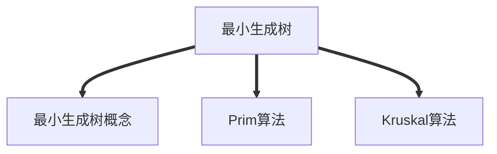

## 最小生成树

<!-- more -->

### 最小生成树概念

* 连通图的生成树是包含图中全部顶点的一个**极小连通子图**(砍去一条边则为非连通图，加上一条边为回路)
* 生成棵生成树可遍历图即可：如广度优先生成树，深度优先生成树
* 最小生成树是指：生成树的权最小(树所有边上的权值之和最小)

#### 关注带权连通无向图$G=(V,E)$

* 只有连通图有生成树，非连通图只有 生成森林
* 如果一个连通图他本身就是树，最小生成树为他本身

### 生成最小生成树算法

#### Prim算法(普里姆算法)

>从某一个顶点开始，每次都选取下一个加入代价最下的顶点。
实现思路：lowCost[]记录加入该树所用的代价，isJoin[]记录是否加入树。每次从lowCost里找最小的值，加入，而后更新lowCost、和isJoin

复杂度分析：
时间：$O|V|^2$适合边稠密的图

#### Kruskal算法

>每次选择权值最小的边，使其相连通，已经连通则 不选择
实现思路：首先生成一个权值表：按各边权值由小到大排列，一个个加入树中，并判断是否已经连通

复杂度分析：
时间：$O|elog_2e|$ $e$为扫描个边，$log_2e$为判断边(两个顶点)是否在已经连通？适用于边疏图
