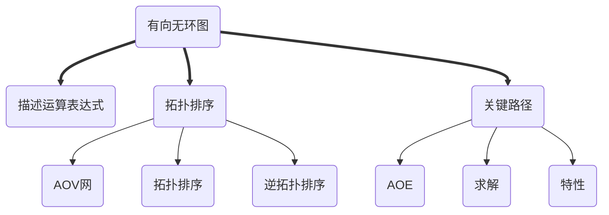
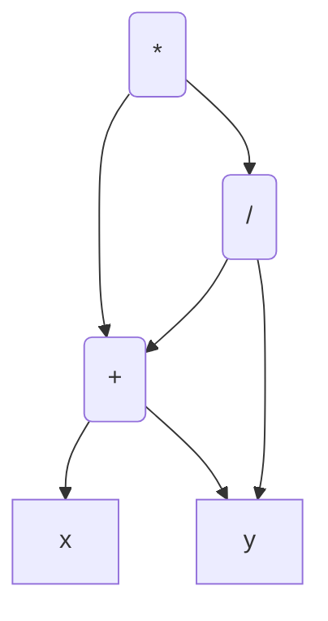
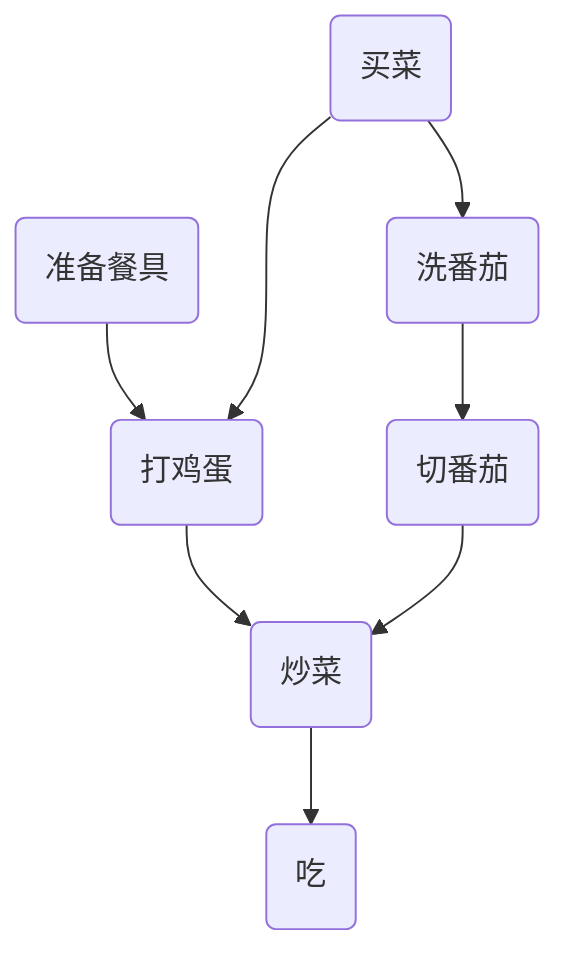

## 有向无环图

* 定义:一个有向图中不存在环(DAG)
* 应用:
    1. 描述运算表达式
    2. 拓扑排序(AOV)
    3. 关键路径(AOE)



### 描述运算表达式

先上一道真题


来一个复杂一点的例子看看
$((a+b）*(b*(c+d))+(c+d)*e)*((c+D)*e)$

最后应该为


那么对于真题$(x+y)((x+y)/y)$ 五个顶点



### 拓扑排序

定义:在图论中，由⼀个有向⽆环图 的顶点组成的序列，当且仅当满⾜下列条件时，称为该图的⼀个拓扑排序： ① 每个顶点出现且只出现⼀次。 ② 若顶点A在序列中排在顶点B的前⾯，则在图中不存在从顶点B到顶点A的路径。

直接看AOV网

#### AOV网

* 定义: 用DAG图表示一个工程。顶点表示活动，有向边$<V_i,V_j>$表示活动$V_i$必须先于活动$V_j$进行



对AOV网构造其顶点的拓扑有序序列：
准备餐具->打鸡蛋->买菜->洗番茄->切番茄->炒菜->吃
(一种拓扑排列)

#### AOV网拓扑排序

```c
#define ERROR 0;
#define OK 1;
#define Status int;
typedef struct
{
    int vexnum;
    AdjList vex;
    /* data */
} ALGraph;
typedef struct
{
} Stack;
typedef struct ArcNode
{
    int adjvex;
    int info;
    struct ArcNode *nextArc;
} ArcNode;

typedef struct VNode
{
    int data;
    struct ArcNode *firstArc;
} VNode, AdjList[10];

Status TopologicalSort(ALGraph G)
{
    int indegree[];//存储入度
    Stack S;
    int counter = 0;//计数 判断是否有回路的依据
    FindInDegree(G, indegree);// 获得入度
    InitStack(S);

    //寻找所有入度为0的顶点
    for (int i = 0; i < G.vexnum; ++i)
        if (!indegree[i])
            Push(S, i);

    while (!StackEmpty(S))
    {
        int k;
        Pop(S, k);
        printf("%d\t", k);//输出拓扑排序
        ++counter;
        //删去所有以k为起点的边
        for (ArcNode *p = G.vex[k].firstArc; p; p = p->nextArc)
        {
            int i = p->adjvex;//i为边p的终点
            if (--indegree[i] == 0)//删去一条边 入度为0时入栈
                Push(S, i);
        }
    }

    //回路判定
    if (counter < G.vexnum)
    {
        return ERROR;
    }
    else
    {
        return OK;
    }
}
```

#### AOV网逆拓扑排序

1. 从AOV网中选择一个没有后继的顶点(入度为0)
2. 从网格中删除所有以它为终点的边
3. 重复，直到网空

只用 DFS即可实现

```c
int visited[];
void DFSTraverse(ALGraph G)
{
    for (int i = 0; i < G.vexnum; ++i)
        visited[i] = 0;
    for (int i = 0; i < G.vexnum; ++i)
    {
        if (!visited[i])
        {
            DFS(G, i);
        }
    }
}

void DFS(ALGraph G, int i)
{
    visited[i] = 1;
    for (int w = FirstNeighbor(G, i); w >= 0; w = NextNeighbor(G, w))
    {
        if (!visited[w])
        {
            DFS(G, w);
        }
    }
    printf(i);
}
```

无法判断回路的存在

### 关键路径

#### AOE网

* 定义:带权有向图，以顶点为事件，以有向边表示活动，以边上的权值为完成该活动的开销
* 只有在某顶点所代表的事件发生后，从该顶点出发的各有向边才能开始活动
* 只有在进入某顶点的各有向边的活动都结束，该顶点所代表的事件才能发生
* 有些活动是可以并行的
* AOE网中仅有一个入度为0的顶点，为开始顶点(源点)，也仅有一个出度为0的顶点(汇点)，为结束顶点
* 从源点到汇点的路径有多条，具有最大路径长度的路径称为关键路径，关键路径也可能不止一条
* 关键路径上的活动称为关键活动
* **整个工程的最短时间就是关键路径长度，若关键活动不能按时完成，整个工程的完成时间就会延长**


#### 求解

记

* $事件v_k的最早发生时间为ve(k):决定了从v_k为起点的活动能开始的最早时间$
* $活动a_i的最早发生时间为e(i)：决定了该边的起点的事件能发生的最早时间$
* $事件v_k的最晚发生时间为vl(k):是从v_k为起点的活动,在不推迟工程下能最迟的发生时间$
* $活动a_i的最晚发生时间为l(i):是该活动边对应的终点最晚发生时间减去该活动所需时间的值$
* $dut(<i,k>):边<i,k>的持续时间,即活动的持续时间$

以上能看出:$ve(k)$和$e(i)$能被先确定，$vl(k)$和$l(i)$要先确定终点的$ve(k)$或$e(i)$

$有 ve(0)=0;ve(k)=Max\{ve(i)+dut(<i,k>)\}$
$vl(n-1)=ve(n-1) (汇点的最早与最迟相同);vl(k) = Min\{vl(i)-dut(<k,i>)\} 等价于vl(i)-Max(dut(<k,i>)$

**关键路径上的关键活动有:$e(i)=l(i)$**

* $e(i)=ve(i)$
* $l(i)=vl(k)-dut(<i,k>)$

##### 算法

1. 拓扑排序求$ve(i)$
2. 逆拓扑排序求$vl(i)$
3. 求$e(i),l(i)$

```c
int ve[],vl[];

Status TopologicalSort(ALGraph G, Stack &T)
{
    ve[0] = 0;
    Stack S;
    int counter = 0;
    FindInDegree(G, indegree);
    InitStack(S);

    for (int i = 0; i < G.vexnum; ++i)
        if (!indegree[i])
            Push(S, i);

    while (!StackEmpty(S))
    {
        int k;
        Pop(S, k);
        Push(T, k);
        ++counter;
        for (ArcNode *p = G.vex[k].firstArc; p; p = p->nextArc)
        {
            int i = p->adjvex;
            if (ve[i] < ve[k] + p->info )
                ve[i] = ve[k] + p->info;
            if (--indegree[k] == 0)
                Push(S, k);
        }
    }

    if (counter < G.vexnum)
    {
        return ERROR;
    }
    else
    {
        return OK;
    }
}

Status CriticalPath(ALGraph G)
{
    InitStack(T);//T用于保存逆拓扑排序

    if (!TopologicalSort(G,T))
    {
        for (int i = 0; i < G.vexnum; ++i)
            vl[i] = ve[G.vexnum - 1];//很重要
        int k;
        while (!StackEmpty(T))
        {
            Pop(T, k);
            for (ArcNode *p = G.vex[k].firstArc; p; p = p->nextArc)
            {
                int i = p->adjvex;
                if ((vl[k] - p->info) < vl[i])
                    vl[i] = vl[k] - p->info;
            }
        }

        for (int i = 0; i < G.vexnum; ++i)
        {
            for (ArcNode *p = G.vex[i].firstArc; p; p = p->nextArc)
            {
                int k = p->adjvex;
                int e = ve[i];
                int l = vl[k] - p->info;
                if(e == l) printf("%d",i);
            }
        }
    }
    
}
```

#### 特性

1. 关键活动的耗时增加，则整个工程延长
2. 缩短关键活动时间，可以缩短工期
3. 当缩短关键活动时间，可能使得其变为非关键活动
4. 可能有多个关键路径，此时缩短某个关键活动时间不能缩短工期，只有缩短并集才能缩短工期
